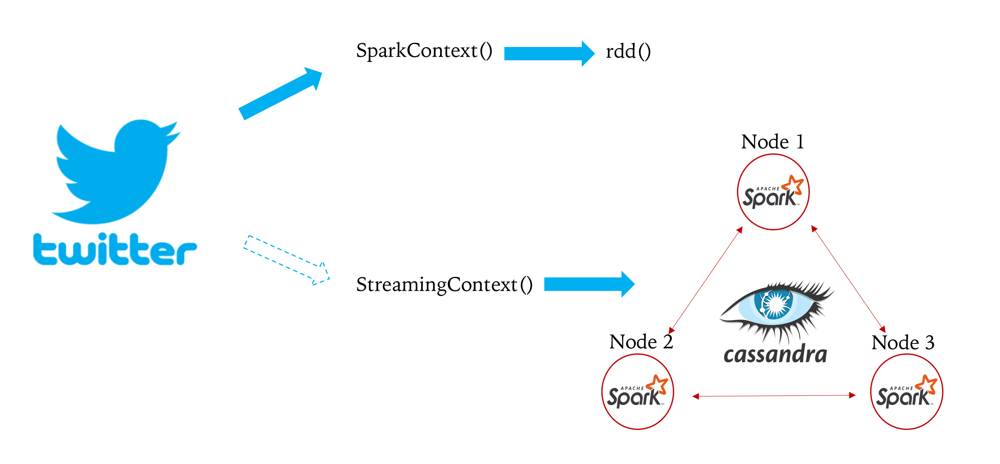

# Architecture

<p align="center">
</p>
<p align="center">Figure 1. Cassandra Architecture</p>

# Execution steps

```
$ ssh root@50.97.252.101
```

Enter the password. 

spark-submit with 
- 10s interval  
- 30s total duration  
- 5 top hashtags 

```
$SPARK_HOME/bin/spark-submit --master spark://spark1:7077  --packages org.apache.bahir:spark-streaming-twitter_2.11:2.1.0,com.datastax.spark:spark-cassandra-connector_2.11:2.0.3  --class Main $(find target -iname "*.jar") 10 30 5
```

# Details

1. <a href=https://github.com/kckenneth/Cassandra/blob/master/setup.md>How to setup spark, cassandra</a>
2. <a href=https://github.com/kckenneth/Cassandra/blob/master/streaming_tweet.md>Streaming Tweet</a> 
3. <a href=https://github.com/kckenneth/Cassandra/blob/master/execution.md>Execution</a>

