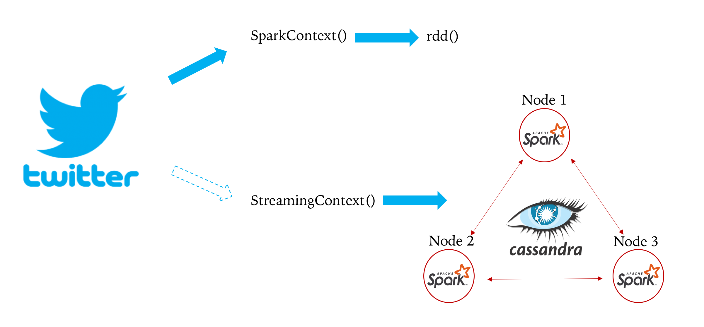

|Title |  Spark Installation |
|-----------|----------------------------------|
|Author | Kenneth Chen |
|Utility | Spark, Cassandra, Twitter |
|Date | 11/03/2018 |

# Architecture

<p align="center">
</p>
<p align="center">Figure 1. Cassandra Architecture</p>

This is the simplification of Spark and Cassandra setup in our tweet analysis. Basically if you're retrieving tweets one time, you'd use `SparkContext()` and save the data in `rdd()`. However if you're streaming the tweets and would like to analyze on the fly, storing them in `rdd()` for quite sometime is risky because you don't know how long you want to stream and the capacity of the drive itself presents another issue in storage. To overcome this, you would like to stream tweets and feed them into database system where your tweets will be stored immediately and replicated across all available nodes you setup. In our example, we setup 3 nodes, and installed Spark in each of of them. Our master node is `spark1`. So the spark object is `StreamingContext`. 

### Note
You cannot use `SparkContext()` and `StreamingContext()` together in spark. You need to initiate one object. If you're initiating in `SparkContext()`, and would like to use for `StreamingContext()`, you need to 

```
val sc = new SparkContext(conf)
val ssc = new StreamingContext(sc, Seconds(1))
```
# Spark setup

Please go to setup in details. 
<a href=https://raw.githubusercontent.com/kckenneth/Spark/master/setup.md>setup</a>


